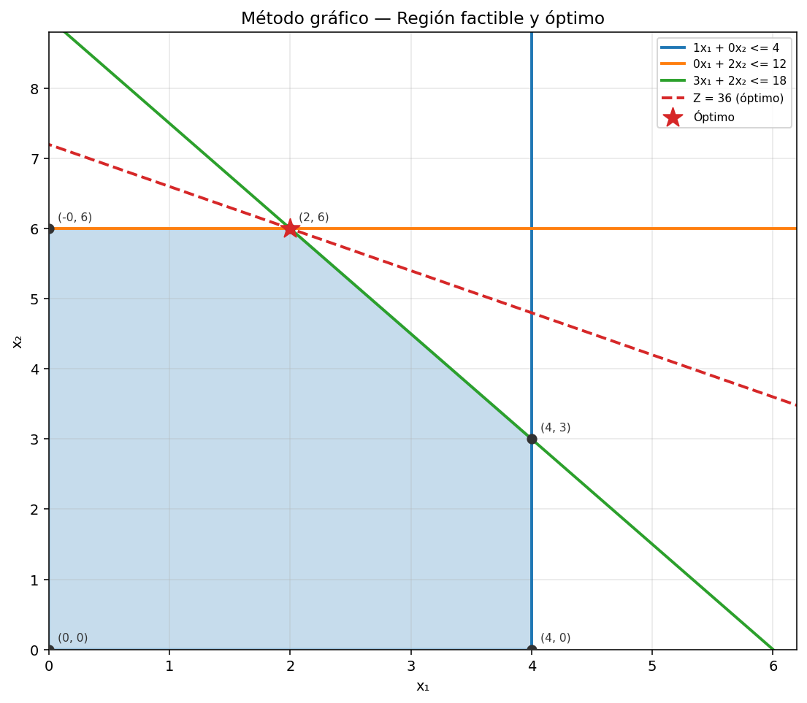
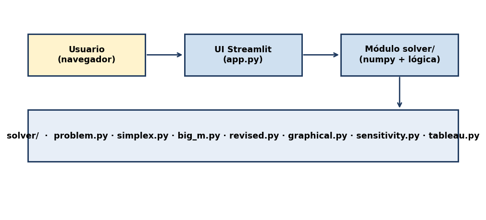
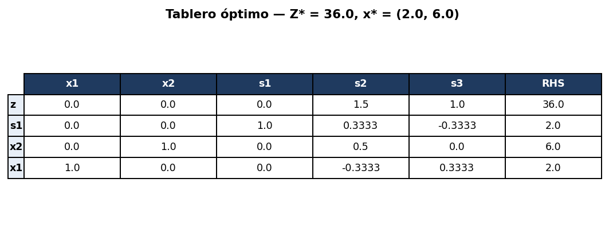
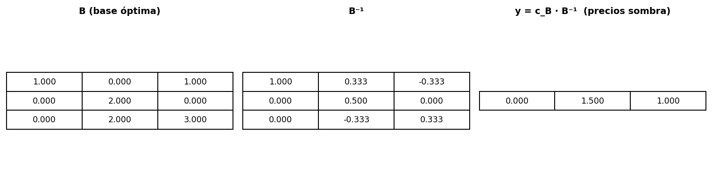
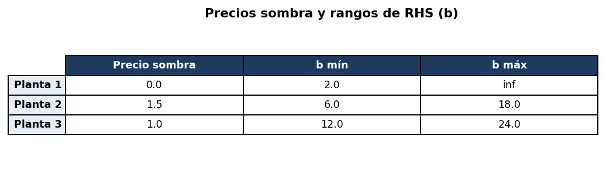
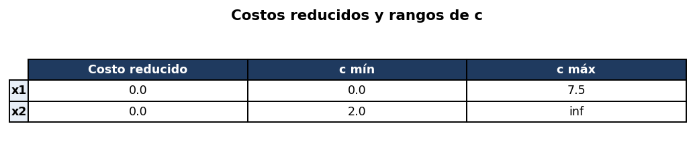

<div class="cover">

<p class="cover-uni">Universidad de Antioquia</p>
<p class="cover-fac">Facultad de Ingeniería — Departamento de Ingeniería de Sistemas</p>

<h1 class="cover-title">Solver de Programación Lineal</h1>
<p class="cover-sub">Resolución paso a paso, métodos Simplex, Gran M, Gráfico y análisis de sensibilidad</p>

<div class="cover-box">
<p><strong>Curso</strong> · Optimización 2026-1</p>
<p><strong>Trabajo</strong> · Programación Lineal — Entrega final</p>
<p><strong>Fecha</strong> · 30 de mayo de 2026</p>
</div>

<div class="cover-team">
<p class="cover-team-title">Equipo</p>
<p>Gabriel Jaime Cardona Montoya</p>
<p>Juan Sebastián Tabares</p>
</div>

<p class="cover-repo">Repositorio público: <code>github.com/gjcardonam/optimizacion-pl-udea</code></p>

</div>


# 1. Descripción del programa

El programa es un **solver interactivo de Programación Lineal** desarrollado en **Python 3.13** con interfaz web en **Streamlit**. Recibe el problema en su **forma básica** (antes de la aumentada), lo convierte automáticamente a forma estándar y muestra la solución **paso a paso, tablero por tablero**, replicando el formato de las diapositivas del curso.

El sistema escoge automáticamente el método apropiado:

- **Simplex tabular básico** cuando todas las restricciones son del tipo ≤ (la base inicial trivial con holguras es factible).
- **Método de la Gran M** cuando existen restricciones ≥ o = (se requieren variables artificiales penalizadas).

Adicionalmente expone el **Simplex Revisado** en forma matricial (B, B⁻¹, c_B·B⁻¹), el **método gráfico** para problemas de 2 variables y un **análisis de sensibilidad** post-óptimo con precios sombra, costos reducidos y rangos de variación.

# 2. Problema modelo

Para validar el comportamiento del programa se usa como problema de referencia el clásico de **Wyndor Glass** (Hillier & Lieberman):

> Wyndor Glass debe decidir cuántos lotes producir de dos productos nuevos (puertas y ventanas) para **maximizar la utilidad**, sujeto a la disponibilidad de tiempo en tres plantas de producción.

**Formulación matemática:**

<div class="formula">
<p><b>MAX</b> &nbsp;&nbsp; Z = 3·x₁ + 5·x₂</p>
<p>sujeto a:</p>
<table class="formula-table">
<tr><td>x₁</td><td>≤ 4</td><td>(Planta 1)</td></tr>
<tr><td>2·x₂</td><td>≤ 12</td><td>(Planta 2)</td></tr>
<tr><td>3·x₁ + 2·x₂</td><td>≤ 18</td><td>(Planta 3)</td></tr>
<tr><td>x₁, x₂</td><td>≥ 0</td><td></td></tr>
</table>
</div>

**Solución óptima** (verificada con todos los métodos): `x₁ = 2`, `x₂ = 6`, `Z* = 36`.

El método gráfico generado automáticamente por el programa es:




# 3. Arquitectura

El proyecto separa la lógica del solver de la interfaz: el módulo `solver/` es independiente y reutilizable.



```
optimizacion-pl/
├── app.py                  UI Streamlit
├── solver/
│   ├── problem.py          LPProblem · conversión forma básica → estándar
│   ├── tableau.py          Representación de un tablero Simplex
│   ├── simplex.py          Simplex tabular básico
│   ├── big_m.py            Método de la Gran M
│   ├── revised.py          Simplex Revisado (forma matricial)
│   ├── graphical.py        Método gráfico (matplotlib)
│   └── sensitivity.py      Análisis de sensibilidad
├── tests/                  Suite de validación
└── DOCUMENTO.md / .pdf     Este entregable
```

# 4. Operaciones que realiza el programa

## 4.1 Lectura y normalización

El usuario ingresa el problema en forma básica (vector `c` y restricciones `(aᵢⱼ, ≷, bᵢ)`). El programa:

1. Si es minimización, multiplica `c` por −1 (resuelve internamente como max).
2. Si `bᵢ < 0`, multiplica toda la fila por −1 e invierte el sentido.
3. Agrega variables auxiliares: `sᵢ` (holgura) para ≤, `eᵢ` (exceso) + `aᵢ` (artificial) para ≥, `aᵢ` (artificial) para =.
4. Construye `A`, `b`, `c` extendido e identifica la base inicial.

## 4.2 Simplex tabular

Algoritmo Simplex clásico con regla de Dantzig para la entrada y razón mínima para la salida. Frente a empates usa **regla de Bland** (menor índice básico) para evitar ciclos. Detecta no acotado (columna sin coeficientes positivos) y óptimos múltiples (coef. reducido = 0 en variable no básica).

## 4.3 Gran M

Penaliza artificiales con `−M = −10⁶` en la función objetivo. Antes de iterar, **limpia la fila z** restando `M × fila_i` por cada artificial básica. Tras converger, si alguna artificial sigue con valor > 0 → **INFACTIBLE**.

## 4.4 Método gráfico

Para n=2: intersecta cada par de rectas (incluidos ejes), filtra los vértices factibles, evalúa Z en cada uno y selecciona el óptimo. Grafica con `matplotlib` la región factible, las rectas, los vértices y la curva de nivel `Z = Z*`.

## 4.5 Simplex Revisado

Misma lógica pero expresada en forma matricial. Por iteración calcula y reporta:

| Magnitud | Significado |
|---|---|
| `B` | Matriz base (columnas de A asociadas a la base actual) |
| `B⁻¹` | Inversa de la base |
| `c_B` | Coeficientes objetivo de las variables básicas |
| `x_B = B⁻¹·b` | Valores actuales de las variables básicas |
| `y = c_B · B⁻¹` | Vector dual (precios sombra) |
| `rⱼ = cⱼ − y·Aⱼ` | Costos reducidos de las no básicas |

## 4.6 Análisis de sensibilidad

Calcula desde el tablero óptimo: **precios sombra** (coef. de holguras en fila z), **costos reducidos**, **rangos de RHS** (vía `B⁻¹` y razón sobre `x_B`) y **rangos de coeficientes objetivo** (separando básicas y no básicas).


# 5. Resultados sobre el problema modelo

## 5.1 Tablero óptimo del Simplex



El programa alcanza el óptimo en **2 iteraciones**. Variables básicas: `x₁ = 2`, `x₂ = 6`, `s₁ = 2`; no básicas: `s₂ = s₃ = 0`.

## 5.2 Simplex Revisado (forma matricial)



El vector dual `y = (0, 1.5, 1)` se obtiene como `c_B · B⁻¹` y coincide con los precios sombra del análisis de sensibilidad — lo que confirma la consistencia entre ambos métodos.

## 5.3 Análisis de sensibilidad



**Lectura:**

- **Planta 1** tiene precio sombra 0 → la restricción `x₁ ≤ 4` no está activa (sobra capacidad: `s₁ = 2`). Un aumento de su disponibilidad no mejora Z.
- **Planta 2** tiene precio sombra 1.5 → cada unidad adicional de tiempo en esa planta aumentaría `Z*` en 1.5, dentro del rango `b₂ ∈ [6, 18]`.
- **Planta 3** tiene precio sombra 1.0 → cada unidad adicional aumenta `Z*` en 1.0, dentro del rango `b₃ ∈ [12, 24]`.



Ambas variables `x₁` y `x₂` son básicas (costo reducido = 0). Los rangos indican cuánto puede variar cada coeficiente sin que cambie la base óptima.

# 6. Casos especiales detectados

| Caso | Cómo se detecta |
|---|---|
| **Óptimo único** | Todos los costos reducidos > 0 al converger |
| **Óptimos múltiples** | Existe variable no básica con costo reducido = 0 |
| **No acotado** | La columna entrante no tiene coeficientes positivos para la razón mínima |
| **Infactible** | (Gran M) Alguna artificial básica queda con valor > 0 |
| **Degeneración** | Empate en la razón mínima → se aplica regla de Bland |

# 7. Validación

Suite de tests en `tests/test_all.py`, todos pasando:

| Problema | Resultado esperado | Estado |
|---|---|:---:|
| Wyndor Glass (Hillier) | Z=36, x=(2, 6) | ✔ |
| Dieta (mixto ≤/=/≥) | Z=5.25, x=(7.5, 4.5) | ✔ |
| `max x₁+x₂` con `−x₁+x₂≤1` | No acotado | ✔ |
| `x₁+x₂≤2 ∧ x₁+x₂≥5` | Infactible | ✔ |
| Precios sombra Wyndor | (0, 1.5, 1) | ✔ |
| Rango RHS Planta 2 | [6, 18] | ✔ |
| Simplex Revisado (Wyndor) | y = (0, 1.5, 1) | ✔ |

# 8. Cómo ejecutar el programa

```bash
# Una sola vez
python3 -m venv .venv
.venv/bin/pip install -r requirements.txt

# Lanzar la UI
.venv/bin/streamlit run app.py     # http://localhost:8501

# Correr los tests
.venv/bin/python tests/test_all.py
```

**Tecnologías:** Python 3.13 · NumPy · pandas · Streamlit · matplotlib.
