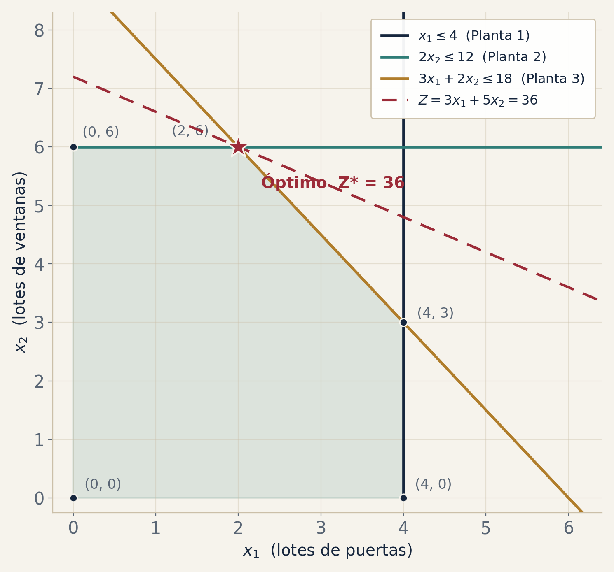

<!-- _class: cover -->
<!-- _paginate: false -->

<div class="kicker">Trabajo Final · Optimización</div>

# Solver de Programación Lineal

<div class="subtitle">Resolución paso a paso, no solo el resultado</div>

<div class="rule"></div>

<div class="meta">
<span class="team">Gabriel Cardona · Juan S. Tabares</span><br>
Universidad de Antioquia — 2026-1
</div>

<div class="methods">
<span class="chip">Simplex</span>
<span class="chip">Gran M</span>
<span class="chip">Simplex Revisado</span>
<span class="chip">Método Gráfico</span>
<span class="chip">Sensibilidad</span>
</div>

---

## ¿Qué problema resolvemos?

Una empresa tiene **recursos limitados** —tiempo de máquina, materia prima, dinero— y debe decidir **cuánto producir de cada producto** para **optimizar un objetivo** sin violar ningún límite.

- Las decisiones → **variables** ( $x_1, x_2, \dots$ )
- El objetivo → una función lineal a **maximizar** o **minimizar**
- Los límites → un conjunto de **restricciones** lineales

> La **Programación Lineal** responde: *¿cuánto de cada cosa, para optimizar el objetivo, respetando todas las restricciones?*

Nuestro software **automatiza** ese cálculo y lo muestra **paso a paso**.

---

## Problema modelo · Wyndor Glass

<div class="cols">
<div>

Decidir cuántos lotes producir de **2 productos** (puertas y ventanas) para **maximizar la utilidad**, limitados por el tiempo de **3 plantas**.

$$
\begin{aligned}
\text{máx } Z =\ & 3x_1 + 5x_2 \\[2pt]
\text{s.a. }\quad & x_1 \le 4 & \text{(Planta 1)}\\
& 2x_2 \le 12 & \text{(Planta 2)}\\
& 3x_1 + 2x_2 \le 18 & \text{(Planta 3)}\\
& x_1,\, x_2 \ge 0
\end{aligned}
$$

</div>
<div>

<div class="stat">
<div><div class="num">2</div><div class="lbl">lotes de puertas · x₁</div></div>
<div><div class="num">6</div><div class="lbl">lotes de ventanas · x₂</div></div>
<div><div class="num">36</div><div class="lbl">utilidad · Z*</div></div>
</div>

<br>

> **Solución óptima verificada** por todos los métodos del solver. Lo usamos como hilo conductor de la presentación y la demo.

</div>
</div>

---

## Métodos implementados

| Método | ¿Cuándo se usa? |
|---|---|
| **Simplex tabular** | Todas las restricciones son ≤ (base inicial trivial) |
| **Gran M** | Hay restricciones ≥ o = (requiere variables artificiales) |
| **Simplex Revisado** | Misma lógica, en forma **matricial** ( B, B⁻¹ ) |
| **Método gráfico** | Problemas de **2 variables** (región factible) |
| **Análisis de sensibilidad** | Post-óptimo: precios sombra y rangos |

<p class="lead-note">El programa elige el método automáticamente según el tipo de restricciones.</p>

---

## Simplex, paso a paso

<div class="cols">
<div>

Idea: moverse de **vértice a vértice** de la región factible, **mejorando Z** en cada salto.

1. Pasar a **forma estándar** (agregar holguras $s_i$ a cada ≤).
2. Armar el **tablero inicial** con la base de holguras.
3. **Variable entrante:** costo reducido más favorable.
4. **Variable saliente:** prueba de la razón mínima.
5. **Pivotear** y repetir hasta que ningún costo reducido mejore → **óptimo**.

</div>
<div>

> En **Wyndor**, el solver llega al óptimo en **2 iteraciones** (3 tableros), registrando cada paso para mostrarlo.

```text
(0,0) --> (0,6) --> (2,6)
 Z=0      Z=30      Z=36
                    óptimo
```

</div>
</div>

---

## Método de la Gran M

Cuando hay restricciones **≥** o **=**, la base de holguras **no sirve** como punto de partida.

- Se agregan **variables artificiales** $a_i$ para tener una base inicial válida.
- Se penalizan en el objetivo con un costo **M** muy grande ( $-M$ al maximizar, $+M$ al minimizar ).
- El Simplex las **expulsa** de la base; la penalización las fuerza a salir.

> Si alguna artificial **queda > 0** en el óptimo → el problema es **infactible**. Así un mismo motor resuelve restricciones mixtas ≤ / = / ≥.

---

## Método gráfico · 2 variables

<div class="cols">
<div>

Para 2 variables, el programa **dibuja** la solución:

- Cada restricción como una **recta**.
- La **región factible** (intersección de todas).
- El **óptimo**, siempre en un **vértice** de la región.

<p class="lead-note">La gráfica se genera automáticamente — fija la intuición geométrica del resultado.</p>

</div>
<div>



</div>
</div>

---

## Análisis de sensibilidad

¿Qué tan **robusta** es la solución óptima? El tablero final responde sin recalcular:

- **Precios sombra** — cuánto cambia Z con **una unidad más** de un recurso.
- **Holguras** — capacidad sobrante; holgura 0 marca un **cuello de botella**.
- **Costos reducidos** — cuánto debe mejorar un producto no usado para que convenga.
- **Rangos** — cuánto puede variar cada coeficiente sin que cambie la base óptima.

> En Wyndor: precios sombra **(0, 1.5, 1)** — las Plantas 2 y 3 son los cuellos de botella.

---

## La aplicación

<div class="cols">
<div>

**Arquitectura limpia y modular**

- `solver/` → motor (simplex, gran M, revisado, gráfico, sensibilidad)
- `app.py` → interfaz web en **Streamlit**
- `tests/` → **12 pruebas** automáticas, con casos especiales

</div>
<div>

**Capacidades**

<span class="chip">2 – 8 variables</span>
<span class="chip">hasta 10 restricciones</span>
<span class="chip">MAX / MIN</span>
<span class="chip">≤ &nbsp; = &nbsp; ≥</span>

**Casos especiales detectados**

<span class="chip">no acotado</span>
<span class="chip">infactible</span>
<span class="chip">óptimos múltiples</span>
<span class="chip">degeneración</span>

</div>
</div>

---

<!-- _class: section -->
<!-- _paginate: false -->

<div class="kicker">En vivo</div>

# Demostración

<div class="rule"></div>

<p>Wyndor Glass de principio a fin — tableros, gráfica y sensibilidad — y luego el problema que proponga el profesor, resuelto en el momento.</p>

---

## Conclusiones

- Construimos un **solver de PL completo** que resuelve **paso a paso**, no solo el resultado final.
- Reúne **Simplex, Gran M, Revisado, Gráfico y Sensibilidad** en una sola herramienta.
- Interfaz usable, validada con **12 pruebas** y casos especiales.
- El usuario se concentra en **analizar y decidir**, no en calcular a mano.

> **¡Gracias!** ¿Preguntas?

<p class="lead-note">github.com/gjcardonam/optimizacion-pl-udea</p>
